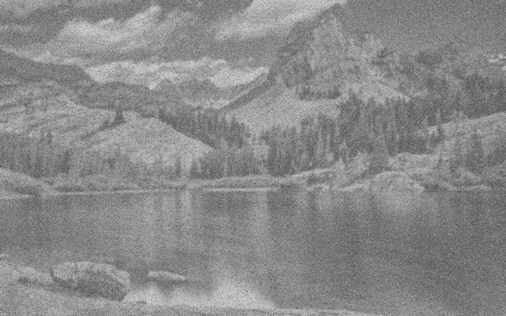
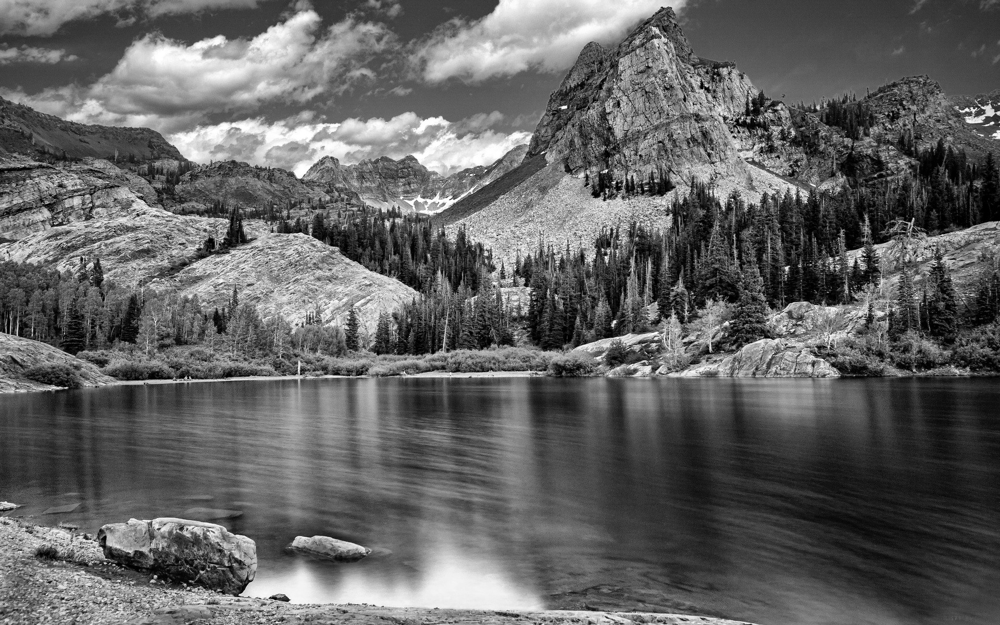
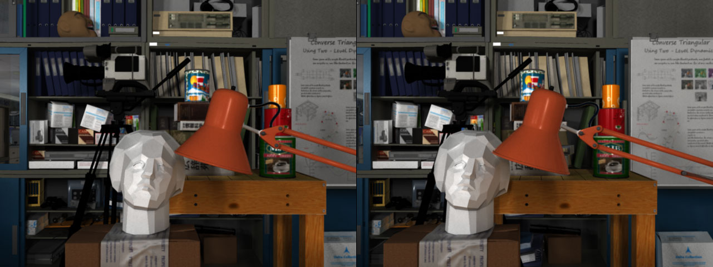
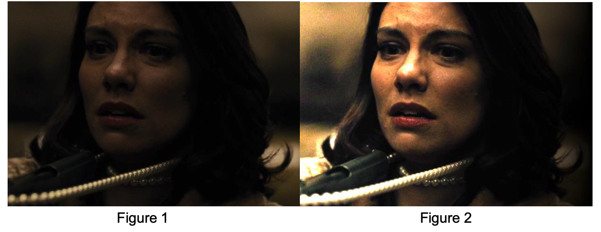
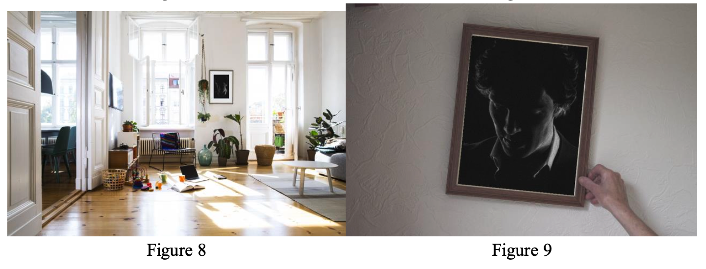
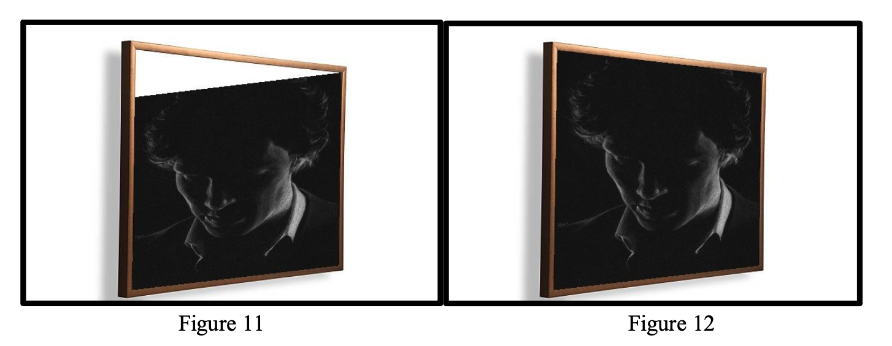

# Image Processing and Computer Vision

## Corrupted Image Correction

Given a corrupted image the program should measure and correct it as follows:

- measured noise using variance, fix using a median filter
- measured blur using a soble kernel, fix using unsharp filter
- measured color collapsing using min and max intensities, fix using contrast stretching

<table>
  <tr>
    <td style="text-align: center;">
      
       
      <em>Corrupted</em>
    </td>
    <td style="text-align: center;">
      
       
      <em>Fixed</em>
    </td>
  </tr>
</table>

## Stereo Vision and Disparity

- Disparity estimation using SSD

## Image Processing

- Color correction
- Blending images
- Fitting an image inside a frame in another image
- Fitting an image inside a frame with a different prespective
- Applying different filters

